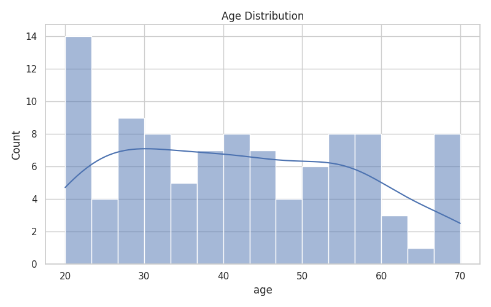
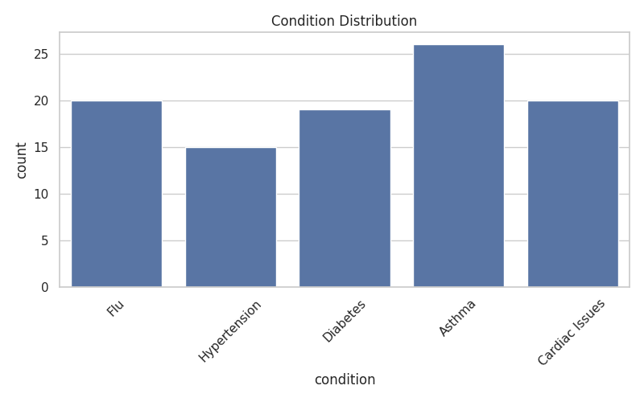
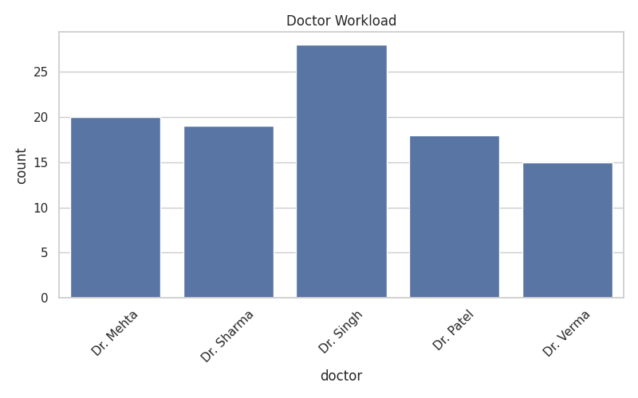
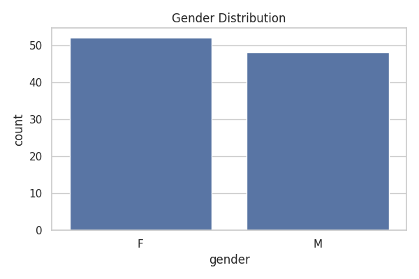
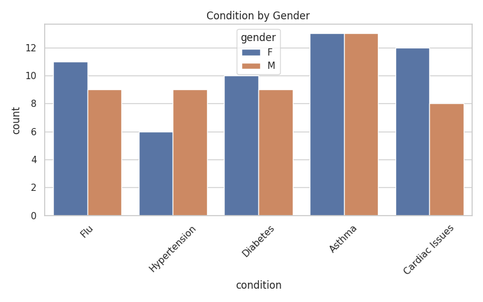

# 🏥 Healthcare Data Analytics & Management System

This project presents a comprehensive healthcare data analysis system designed to explore patient records, appointment trends, and doctor workloads.

Using Python, the project performs data cleaning, exploratory data analysis (EDA), and visualization to uncover meaningful insights from healthcare data and support data-driven decision-making.

---

## ✨ Key Features

📊 Healthcare Data Analysis  
Analyzed patient records to identify trends in medical conditions, age distribution, and appointment patterns.

📈 Data Visualization  
Created multiple visualizations using Matplotlib and Seaborn to better understand healthcare trends.

👨‍⚕️ Doctor Workload Analysis  
Examined appointment distribution across doctors to understand workload patterns.

🧹 Data Cleaning & Processing  
Handled structured healthcare data using Pandas for efficient analysis.

📂 Dataset Handling  
Worked with realistic synthetic healthcare datasets including demographics, conditions, and appointments.

---

## 💻 Technology Stack

- Python  
- Pandas  
- NumPy  
- Matplotlib  
- Seaborn  
- Streamlit (for dashboard)

---

## ⚙️ Installation and Setup

Clone the repository:

```bash
git clone https://github.com/YOUR_USERNAME/Healthcare-Management-System.git
cd Healthcare-Management-System
```

Install dependencies:

```bash
pip install -r requirements.txt
```

---

## ▶️ Running the Project

### Run Data Analysis

```bash
python analysis.py
```

### Run Dashboard (Optional)

```bash
streamlit run app.py
```

---

## 📊 Visualizations

### 📈 Age Distribution


### 🦠 Condition Distribution


### 👨‍⚕️ Doctor Workload


### 👩 Gender Distribution


### 🔍 Condition by Gender

---

## 📊 Key Insights

- Hypertension and Diabetes are among the most common conditions  
- Certain doctors handle significantly more appointments  
- Most patients fall within mid-age groups  
- Gender-based differences exist across some conditions  
- Appointment distribution varies across healthcare needs  

---

## 📂 Dataset

The dataset includes:

- Patient demographics (age, gender, blood type)  
- Medical conditions  
- Doctor assignments  
- Appointment types and dates  

---

## 🚀 Future Improvements

- Build predictive models for disease risk analysis  
- Create advanced dashboards using Power BI  
- Integrate SQL database for scalability  
- Deploy as a web application  

---

## 🤝 Contributing

Contributions and suggestions are welcome!
